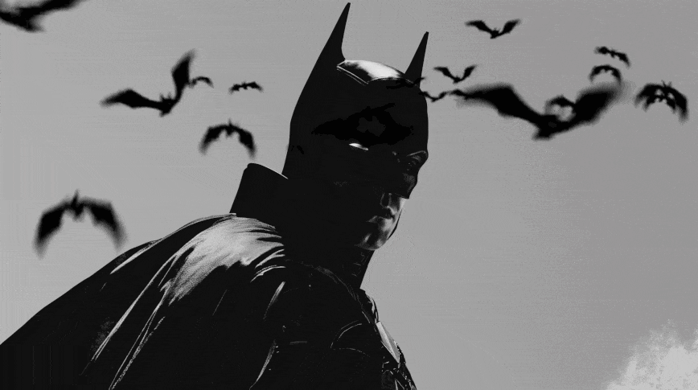

# 🦇 SNPAZIN Portfolio

> "Desenvolvimento moderno e design inovador."

Bem-vindo ao repositório oficial do meu portfólio pessoal. Este projeto foi desenvolvido com foco em uma identidade visual única, combinando estética minimalista dark com elementos do universo do Batman.



## 🚀 Tecnologias Utilizadas

Este projeto foi construído utilizando as tecnologias mais modernas do ecossistema web:

- **React 19**: Biblioteca para construção de interfaces de usuário.
- **TypeScript**: Superset do JavaScript para tipagem estática e segurança.
- **Tailwind CSS 4**: Framework de utilitários para estilização rápida e responsiva.
- **Framer Motion**: Biblioteca para animações fluidas e complexas.
- **Vite**: Build tool de próxima geração para desenvolvimento rápido.
- **Lucide React**: Ícones leves e consistentes.

## 🎨 Destaques do Design

- **Tema Dark/Batman**: Paleta de cores focada em tons escuros e amarelo vibrante.
- **Animações Interativas**: Elementos que reagem ao scroll e interação do usuário.
- **Responsividade**: Layout totalmente adaptável para desktop, tablets e mobile.
- **Performance**: Otimizado para carregamento rápido e transições suaves.

## 🛠️ Como Rodar o Projeto

Siga os passos abaixo para executar o projeto em sua máquina local:

### Pré-requisitos

- Node.js (versão 18 ou superior)
- pnpm (recomendado) ou npm/yarn

### Instalação

1. Clone o repositório:
```bash
git clone https://github.com/snapzin/Portifolio-Oficial.git
cd Portifolio-Oficial
```

2. Instale as dependências:
```bash
pnpm install
# ou
npm install
```

3. Inicie o servidor de desenvolvimento:
```bash
pnpm dev
# ou
npm run dev
```

4. Acesse `http://localhost:3000` no seu navegador.

## 📂 Estrutura do Projeto

```
client/
  ├── public/          # Assets estáticos (imagens, gifs)
  ├── src/
  │   ├── components/  # Componentes React reutilizáveis (Hero, Projects, etc.)
  │   ├── pages/       # Páginas da aplicação
  │   ├── lib/         # Utilitários e configurações
  │   └── index.css    # Estilos globais e configuração do Tailwind
```

## 🤝 Contato

- **GitHub**: [@snapzin](https://github.com/snapzin)
- **Instagram**: [@1zayon_](https://instagram.com/1zayon_)
- **Discord**: `._zayon_.`
- **Email**: zayonantunes@gmail.com

---

Desenvolvido por **snpazin** © 2025.
